# Deployment Project
Deployment project yang dilakukan sebagai projek sesi UTS pada mata kuliah Komdat.

[Sekilas Tentang](#sekilas-tentang) | [Instalasi](#instalasi) | [Cara Pemakaian](#cara-pemakaian) | [Pembahasan](#pembahasan) | [Referensi](#referensi)
:---:|:---:|:---:|:---:|:---:|
# Aplikasi Web Yourls
.png)
# Sekilas Tentang
YOURLS (Your Own URL Shortener) adalah aplikasi yang memungkinkan pengguna untuk melakukan pemendekan URL mereka sendiri di server pribadi. Dengan YOURLS, pengguna memiliki kendali penuh atas tautan yang ia buat, termasuk kemampuan untuk menyesuaikan nama tautan pendek, melacak statistik secara detail, serta mendukung pengembangan dengan berbagai plugin. Sebagai perangkat lunak yang bersifat gratis dan open-source, YOURLS memberikan fleksibilitas bagi pengguna dalam mengelola URL dengan cara yang aman dan terukur. Aplikasi ini cocok digunakan oleh individu maupun organisasi yang menginginkan solusi pemendek URL yang mandiri tanpa ketergantungan pada layanan pihak ketiga.
# Instalasi
## Kebutuhan Sistem
- PHP 7.3 +
- Web Server
- MySQL 5.0+
- HTTPS Support
## Langkah Instalasi

### 1. Download File diGithub YOURLS
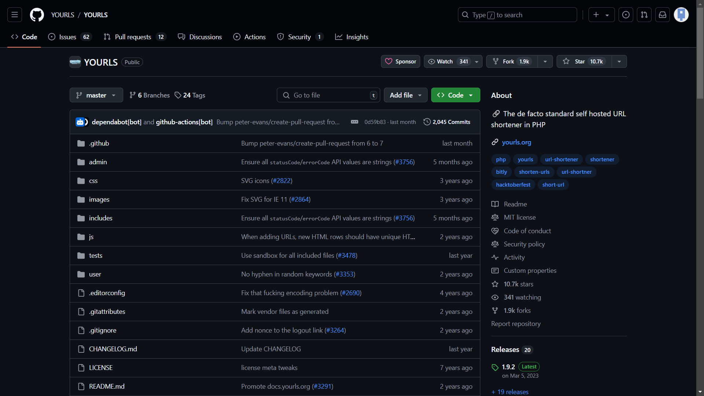
### 2. Setup Web Hosting/VPS
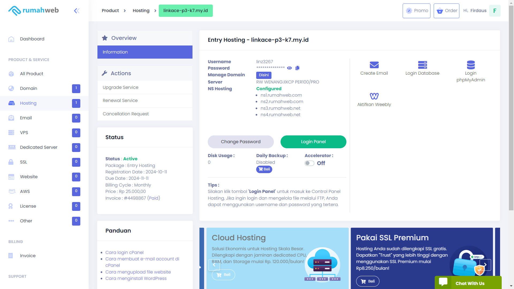
### 3. Pergi ke bagian Cpanel untuk mengatur website
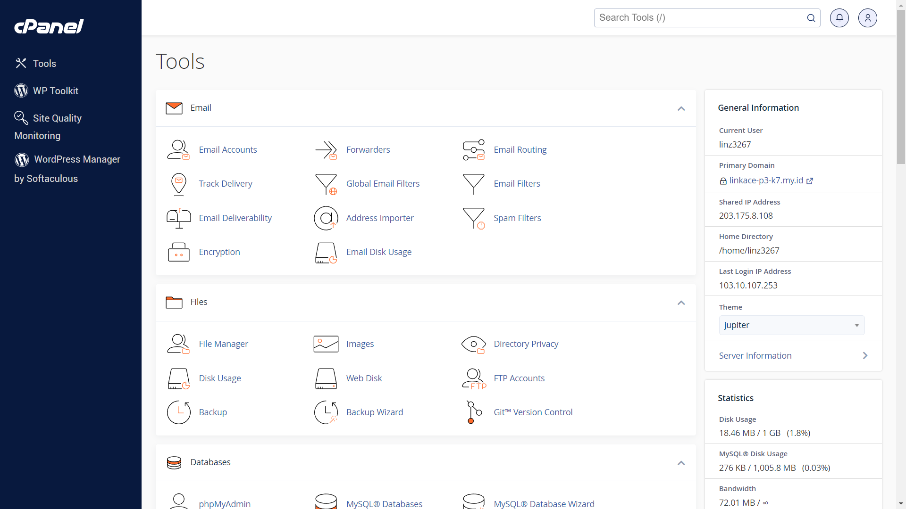
### 4. Pergi ke bagian file manager, dan pilih directory public_html. Kemudian upload dan extract source code yang telah di download sebelumnya
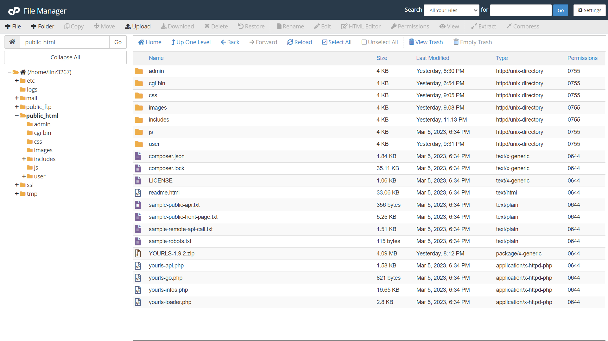
### 5. Set up database baru dan user baru, kemudian sambungkan keduanya
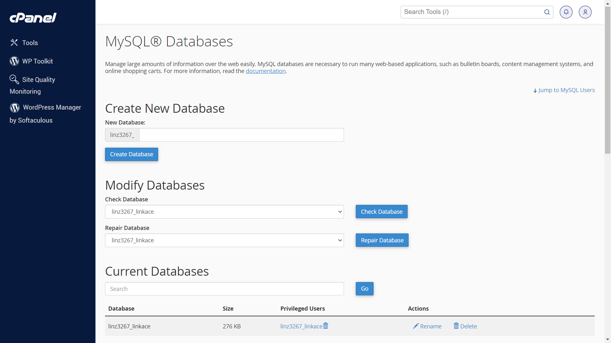
### 6. Konfigurasi file config.php untuk menyesuaikan nama database, user database, password database, dan url dari website, dan juga setup username dan password untuk login ke dalam website. Kemudian upload file tersebut ke direktori user dari folder public_html
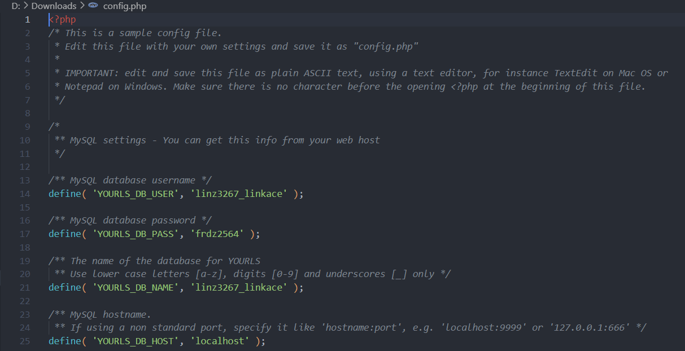
### 7. Buat dan konfigurasi file .htaccess kemudian upload file tersebut ke root pada folder public_htm
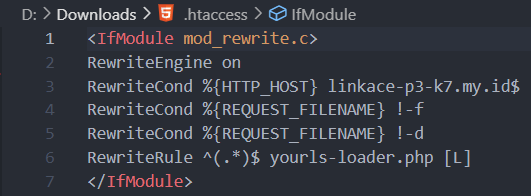
# Cara Pemakaian
Penggunaan web Yourls sangat sederhana, hanya perlu mengikuti langkah-langkah berikut:
### 1. Login kedalam web Yourls terlebih dahulu
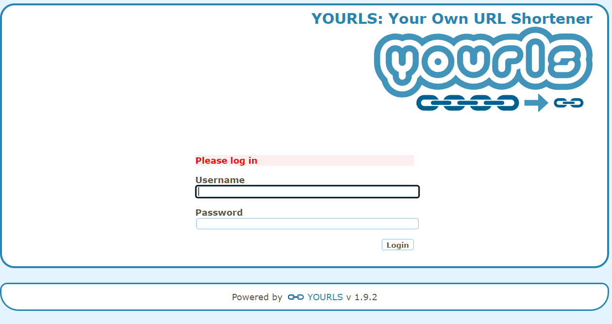
### 2. Setelah itu kita akan masuk ke halaman home dari web Yourls, lalu disana terdapat kolom untuk memsukkan URL yang ingin diperpendek
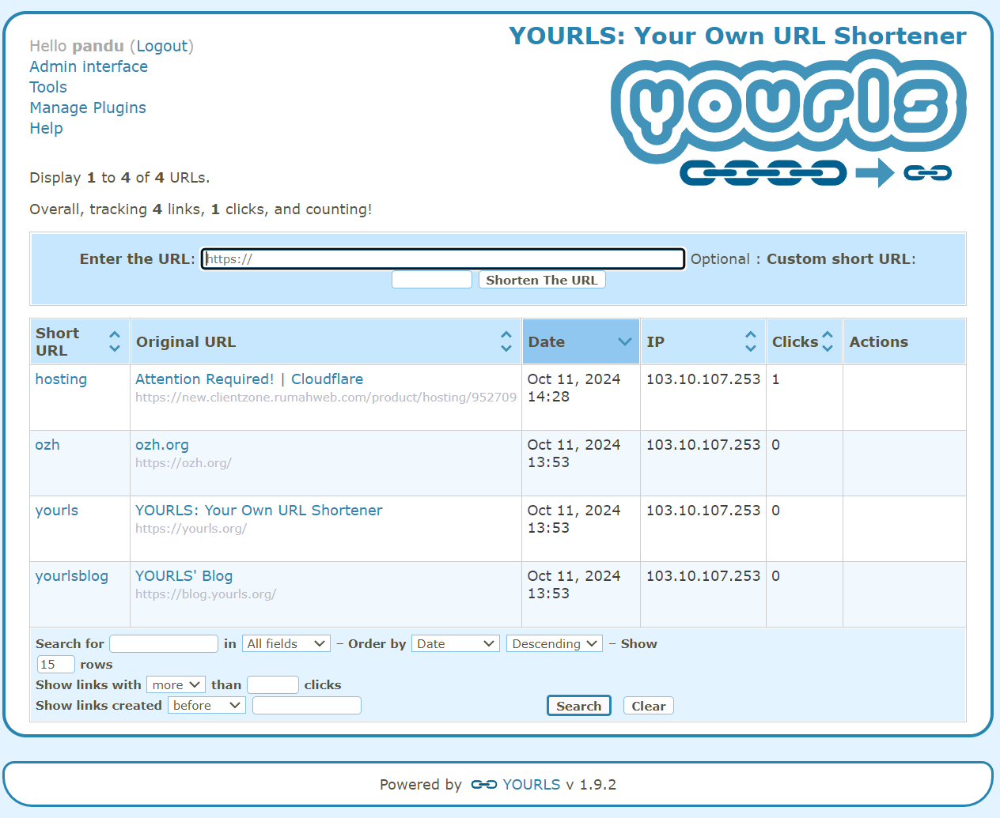
### 3. Lalu Masukkan link yang akan diperpendek dan klik tombol "shorten the URL"
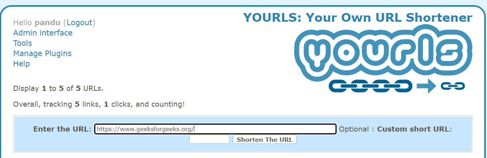
### 4. Tunggu hingga link telah berhasil digenerate dan user dapat menggunakan link tersebut.
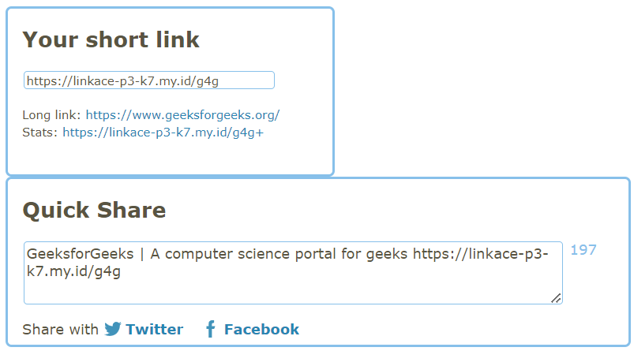
# Pembahasan
Yourls digunakan sebagai alat yang dapat membantu user untuk memperpendek URL pribadi user memiliki kelebihan maupun kekurangan sebagai berikut:

**Kelebihan**
1. Memberikan Statistik Secara Detail
   - Melalu Yourls user akan disajikan statistik tentang jumlah klik, sumber lalu lintas, referer, lokasi geografis, dan perangkat yang digunakan oleh pengunjung. 
2. Kontrol Penuh atas Tautan
   - Yourls membuat user tidak bergantung pada layanan pihak ketiga, sehingga Anda bisa menyesuaikan nama tautan, mengatur pengalihan, dan menghapus tautan sesuai kebutuhan.
3. Perangkat lunak open-source
   - Open-source, yang artinya user bisa mengunduh, menginstal, dan menggunakan aplikasi ini tanpa biaya lisensi. user bisa meng-host YOURLS di server pribadi atau server hosting pilihan Anda, sehingga tidak ada biaya tambahan dari sisi perangkat lunaknya.

**Kekurangan**
1. Tampilan Antar Muka yang Sederhana
   - UI (User Interface) YOURLS, terutama untuk dashboard, cenderung sederhana dan tidak seintuitif beberapa layanan pemendek URL komersial.
2. Tidak Memiliki Dukungan Resmi
   - Karena YOURLS adalah open-source, tidak ada dukungan pelanggan resmi seperti yang biasanya disediakan oleh layanan berbayar. 
3. Keamanan Tergantung Pada Pengguna
   - Karena user meng-host YOURLS di server pribadi, keamanan data sangat tergantung pada bagaimana user mengonfigurasi server dan aplikasi.

Dibandingakan dengan web seperti shorturl.at, website Yourls masih lebih memberikan kualitas yang lebih baik kepada user dari segi fungsional.Namun jika dibandingkan dengan web bitly.com, Yourls masih kurang dibagian antarmuka usernya.
# Referensi
1. [LinkYourls](https://yourls.org/docs) - Website Yourls
2. [LinkYourls](https://www.shorturl.at/) - Website Shorturl
3. [LinkBitly](https://bitly.com/) - Website Bitly
